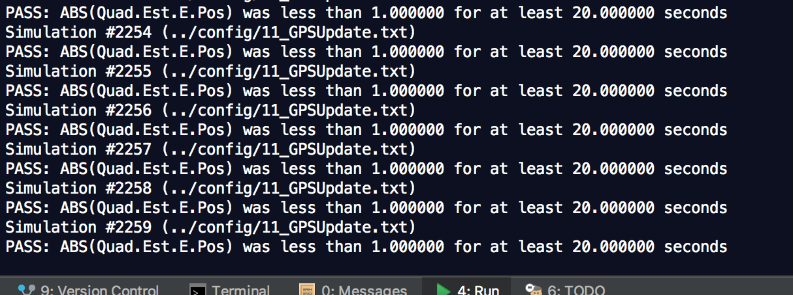

# Estimation Project #

Welcome to the estimation project.  In this project, you will be developing the estimation portion of the controller used in the CPP simulator.  By the end of the project, your simulated quad will be flying with your estimator and your custom controller (from the previous project)!

This README is broken down into the following sections:

 - [Setup](#setup) - the environment and code setup required to get started and a brief overview of the project structure
 - [The Tasks](#the-tasks) - the tasks you will need to complete for the project
 - [Tips and Tricks](#tips-and-tricks) - some additional tips and tricks you may find useful along the way
 - [Submission](#submission) - overview of the requirements for your project submission


## Setup ##

This project will continue to use the C++ development environment you set up in the Controls C++ project.

 1. Clone the repository
 ```
 git clone https://github.com/udacity/FCND-Estimation-CPP.git
 ```

 2. Import the code into your IDE like done in the [Controls C++ project](https://github.com/udacity/FCND-Controls-CPP#development-environment-setup)
 
 3. You should now be able to compile and run the estimation simulator just as you did in the controls project


### Project Structure ###

For this project, you will be interacting with a few more files than before.

 - The EKF is already partially implemented for you in `QuadEstimatorEKF.cpp`

 - Parameters for tuning the EKF are in the parameter file `QuadEstimatorEKF.txt`

 - When you turn on various sensors (the scenarios configure them, e.g. `Quad.Sensors += SimIMU, SimMag, SimGPS`), additional sensor plots will become available to see what the simulated sensors measure.

 - The EKF implementation exposes both the estimated state and a number of additional variables. In particular:

   - `Quad.Est.E.X` is the error in estimated X position from true value.  More generally, the variables in `<vehicle>.Est.E.*` are relative errors, though some are combined errors (e.g. MaxEuler).

   - `Quad.Est.S.X` is the estimated standard deviation of the X state (that is, the square root of the appropriate diagonal variable in the covariance matrix). More generally, the variables in `<vehicle>.Est.S.*` are standard deviations calculated from the estimator state covariance matrix.

   - `Quad.Est.D` contains miscellaneous additional debug variables useful in diagnosing the filter. You may or might not find these useful but they were helpful to us in verifying the filter and may give you some ideas if you hit a block.


#### `config` Directory ####

In the `config` directory, in addition to finding the configuration files for your controller and your estimator, you will also see configuration files for each of the simulations.  For this project, you will be working with simulations 06 through 11 and you may find it insightful to take a look at the configuration for the simulation.

As an example, if we look through the configuration file for scenario 07, we see the following parameters controlling the sensor:

```
# Sensors
Quad.Sensors = SimIMU
# use a perfect IMU
SimIMU.AccelStd = 0,0,0
SimIMU.GyroStd = 0,0,0
```

This configuration tells us that the simulator is only using an IMU and the sensor data will have no noise.  You will notice that for each simulator these parameters will change slightly as additional sensors are being used and the noise behavior of the sensors change.


## The Tasks ##

Once again, you will be building up your estimator in pieces.  At each step, there will be a set of success criteria that will be displayed both in the plots and in the terminal output to help you along the way.

Project outline:

 - [Step 1: Sensor Noise](#step-1-sensor-noise)
 - [Step 2: Attitude Estimation](#step-2-attitude-estimation)
 - [Step 3: Prediction Step](#step-3-prediction-step)
 - [Step 4: Magnetometer Update](#step-4-magnetometer-update)
 - [Step 5: Closed Loop + GPS Update](#step-5-closed-loop--gps-update)
 - [Step 6: Adding Your Controller](#step-6-adding-your-controller)


### Step 1: Sensor Noise ###

For the controls project, the simulator was working with a perfect set of sensors, meaning none of the sensors had any noise.  The first step to adding additional realism to the problem, and developing an estimator, is adding noise to the quad's sensors.  For the first step, you will collect some simulated noisy sensor data and estimate the standard deviation of the quad's sensor.

Process the logged files to figure out the standard deviation of the the GPS X signal and the IMU Accelerometer X signal.

The script to calculate the standard deviation is [`cal_std.py`](cal_std.py).

Standard deviation:


<p align="center">

</p>

***Success criteria:*** *Your standard deviations should accurately capture the value of approximately 68% of the respective measurements.*

Screenshot of passing result:


### Step 2: Attitude Estimation ###

I use the following equation to convert body frame turning rate to Euler rate.


Then I integrate the result into the estimated pitch and roll angle, line 104-111 [`QuadEstimatorEKF.cpp`](src/QuadEstimatorEKF.cpp#L104).
```
  V3F euler_dot = R * gyro;
  float predictedPitch = pitchEst + dtIMU * euler_dot.y;
  float predictedRoll = rollEst + dtIMU * euler_dot.x;
  ekfState(6) = ekfState(6) + dtIMU * euler_dot.z;

  // normalize yaw to -pi .. pi
  if (ekfState(6) > F_PI) ekfState(6) -= 2.f*F_PI;
  if (ekfState(6) < -F_PI) ekfState(6) += 2.f*F_PI;
```

<p align="center">

</p>

***Success criteria:*** *Your attitude estimator needs to get within 0.1 rad for each of the Euler angles for at least 3 seconds.*


### Step 3: Prediction Step ###

This step consists of two scenarios;

For the first scenario, i implemented the state prediction based on the acceleration measurement by using Dead Reckoning method.

The implementation of this step is in [`QuadEstimatorEKF.cpp`](src/QuadEstimatorEKF.cpp#L173) from line 173 to line 181.

```
  predictedState(0) = curState(0) + curState(3) * dt;
  predictedState(1) = curState(1) + curState(4) * dt;
  predictedState(2) = curState(2) + curState(5) * dt;

  V3F acc_inertial = attitude.Rotate_BtoI(accel);

  predictedState(3) = curState(3) + acc_inertial.x * dt;
  predictedState(4) = curState(4) + acc_inertial.y * dt;
  predictedState(5) = static_cast<float >(curState(5) + acc_inertial.z * dt - CONST_GRAVITY * dt);
```

<p align="center">

</p>

For the second scenario, I first calculated the partial derivative of the body-to-global rotation matrix in the function GetRbgPrime() by using the following equations.


The code is line 209-223 in [`QuadEstimatorEKF.cpp`](src/QuadEstimatorEKF.cpp#L209).

```
  float theta = pitch;
  float phi = roll ;
  float psi = yaw ;

  RbgPrime(0,0) = (- ( cos(theta) * sin(psi) ) );
  RbgPrime(0,1) = (- ( sin(phi) * sin(theta) * sin(psi) ) - ( cos(phi) * cos(psi) ) );
  RbgPrime(0,2) = (- ( cos(phi) * sin(theta) * sin(psi) ) + ( sin(phi) * cos(psi) ) );

  RbgPrime(1,0) = ( cos(theta) * cos(psi) ) ;
  RbgPrime(1,1) = ( sin(phi) * sin(theta) * cos(psi) ) - ( cos(phi) * sin(psi) );
  RbgPrime(1,2) = ( cos(phi) * sin(theta) * cos(psi) ) + ( sin(phi) * sin(psi) );

  RbgPrime(2,0) = 0;
  RbgPrime(2,1) = 0;
  RbgPrime(2,2) = 0;
```

Then the Jacobian Matrix is implemented using the below equation:


Prediction code uses line 1-5 in the following pseudo-code.


The real implementation is line 269-278 in [`QuadEstimatorEKF.cpp`](src/QuadEstimatorEKF.cpp#L269).

```
  gPrime(0,3) = dt;
  gPrime(1,4) = dt;
  gPrime(2,5) = dt;

  gPrime(3, 6) = (RbgPrime(0) * accel).sum() * dt;
  gPrime(4, 6) = (RbgPrime(1) * accel).sum() * dt;
  gPrime(5, 6) = (RbgPrime(2) * accel).sum() * dt;

  // From "Estimation for Quadrotors" paper ( Section 3 )
  ekfCov = gPrime * ekfCov * gPrime.transpose() + Q;
```
<p align="center">

</p>

***Success criteria:*** *This step doesn't have any specific measurable criteria being checked.*


### Step 4: Magnetometer Update ###

In this step, the information from the magnetometer is added to improve your filter's performance in estimating the vehicle's heading.

The equations are:


The code implementation is line 335-344 in [`QuadEstimatorEKF.cpp`](src/QuadEstimatorEKF.cpp#L338).

```
  hPrime(0, 6) = 1;

  zFromX(0) = ekfState(6);
  
  float diff = magYaw - zFromX(0);
  if ( diff > F_PI ) {
    zFromX(0) += 2.f*F_PI;
  } else if ( diff < -F_PI ) {
    zFromX(0) -= 2.f*F_PI;
  }
```

<p align="center">

</p>

***Success criteria:*** *Your goal is to both have an estimated standard deviation that accurately captures the error and maintain an error of less than 0.1rad in heading for at least 10 seconds of the simulation.*


### Step 5: Closed Loop + GPS Update ###

In this step, the GPS update is implemented using the below equation.


Implementation is line 302-314 in [`QuadEstimatorEKF.cpp`](src/QuadEstimatorEKF.cpp#L302).

<p align="center">

</p>

***Success criteria:*** *Your objective is to complete the entire simulation cycle with estimated position error of < 1m.*


### Step 6: Adding Your Controller ###

In this step, the controller is replaced with the controller I implemented in the third project, and I de-tuned the parameters.

<p align="center">

</p>

***Success criteria:*** *Your objective is to complete the entire simulation cycle with estimated position error of < 1m.*




**References**

* [1] S. Tellex, A. Brown and S. Lupashin, 2018, ["Estimation for Quadrotors"](https://www.overleaf.com/read/vymfngphcccj#/54894644/)
